<p align="center">
  
</p>

<h1 align="center">GleanGrid</h1>

<p align="center">
  <strong>Farm fresh, just a click away.</strong><br>
  Pre-order this week’s harvest from Hyderabad’s farmers markets, pay with Easypaisa, JazzCash, card or cash, and collect it at the stall.
</p>

<p align="center">
  <a href="https://gleangrid.ahmershah.dev">gleangrid.ahmershah.dev</a> ·
  Aptech TechWiz 7 — <em>MarketLink · eGreen Basket</em> ·
  Hyderabad, Sindh, Pakistan
</p>

<p align="center">
  <a href="https://github.com/ahmershahdev/GleanGrid/actions/workflows/ci.yml"></a>
  <a href="LICENSE.txt"></a>
  
  
  
  
  <a href="CONTRIBUTING.md"></a>
</p>

---

## Contents

1. [What it is](#what-it-is)
2. [Screenshots](#screenshots)
3. [Features at a glance](#features-at-a-glance)
4. [SRS coverage](#srs-coverage)
5. [Tech stack](#tech-stack)
6. [Architecture](#architecture)
7. [Database design](#database-design)
8. [Security](#security)
9. [Concurrency & race conditions](#concurrency--race-conditions)
10. [Online payments](#online-payments)
11. [Social sign-in (Google & Facebook): what we store](#social-sign-in-google--facebook-what-we-store)
12. [Badges, price history, seasons, photo reviews & alerts](#badges-price-history-seasons-photo-reviews--alerts)
13. [SEO, performance & accessibility](#seo-performance--accessibility)
14. [Internationalisation](#internationalisation)
15. [Running locally (XAMPP)](#running-locally-xampp)
16. [Troubleshooting](#troubleshooting)
17. [Deploying to production](#deploying-to-production)
18. [Testing & CI](#testing--ci)
19. [Project structure](#project-structure)
20. [Assumptions](#assumptions)
21. [Contributing, security & licence](#contributing-security--licence)
22. [Author & credits](#author--credits)

---

## What it is

Shoppers rarely know which farmers will be at a market, what they’ll have, or at what price. Farmers can’t take orders before market day. GleanGrid fixes both:

- **Farmers** publish weekly stock, prices and pickup windows for each market they trade at, then accept, prepare and hand over pre-orders.
- **Customers** find markets on a live map, browse and filter produce, reserve items against real stock, pick a pickup window and **pay online with Easypaisa, JazzCash or a debit/credit card — or pay the farmer in person**. Pickup only, no delivery.
- **Administrators** approve stalls, moderate content, manage markets and master data, publish announcements and read platform reports.

Every page is responsive, available in **8 languages** (including right-to-left Urdu and Arabic), and works in light and dark themes.

## Screenshots

| Home | Produce | Product |
|---|---|---|
| 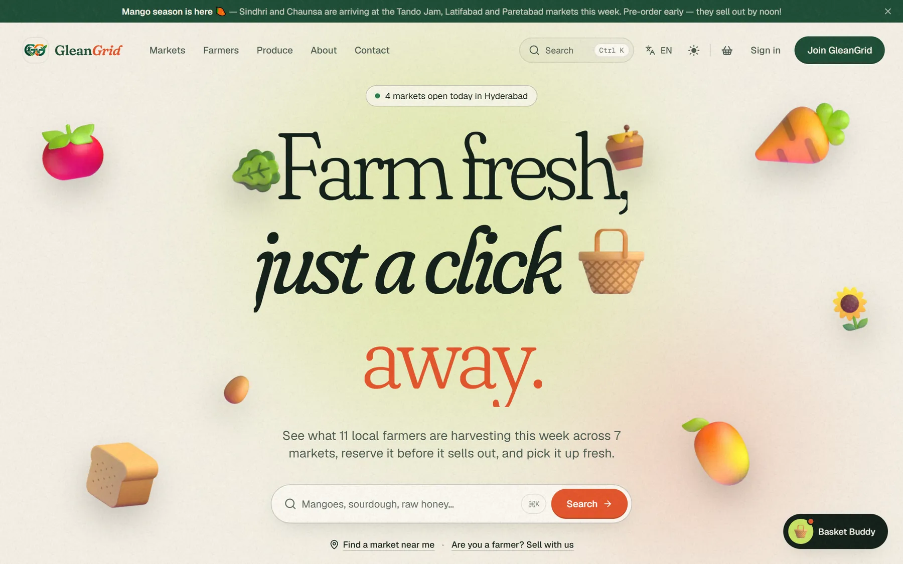 | 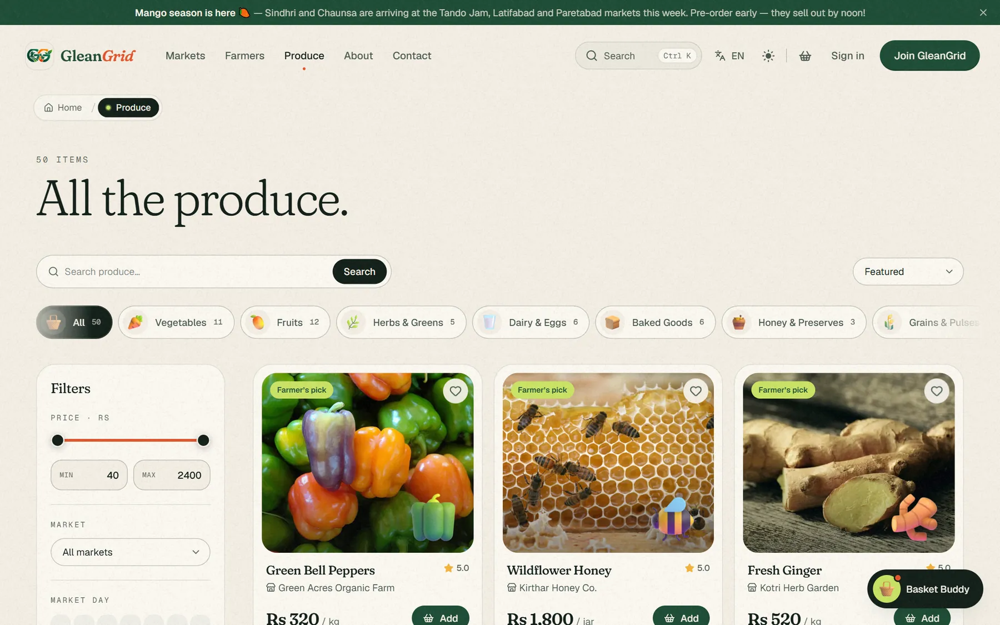 | 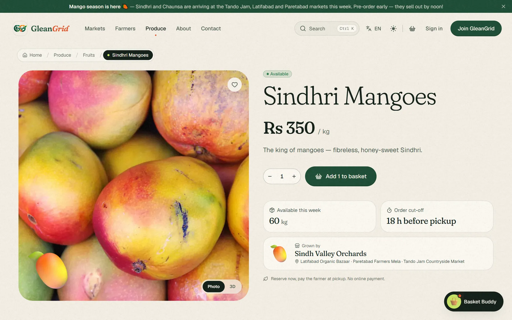 |
| **Basket** | **Checkout** | **Search** |
| 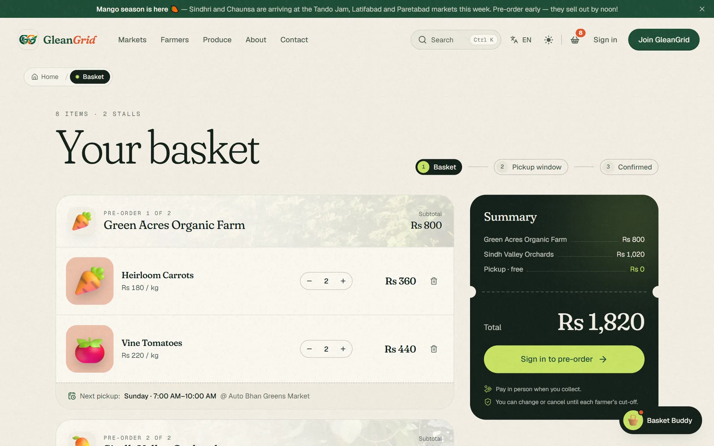 | 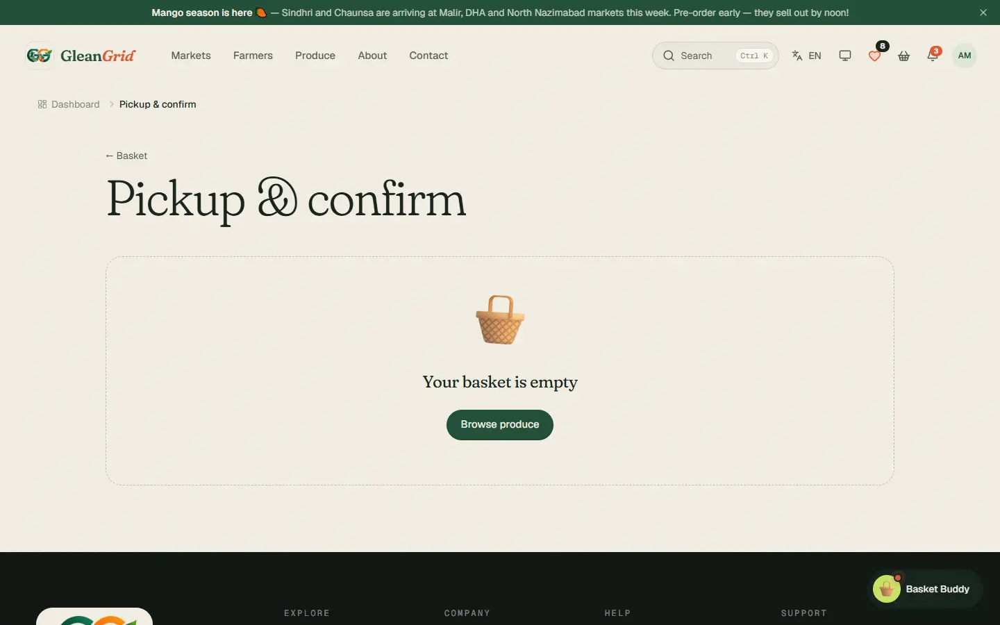 | 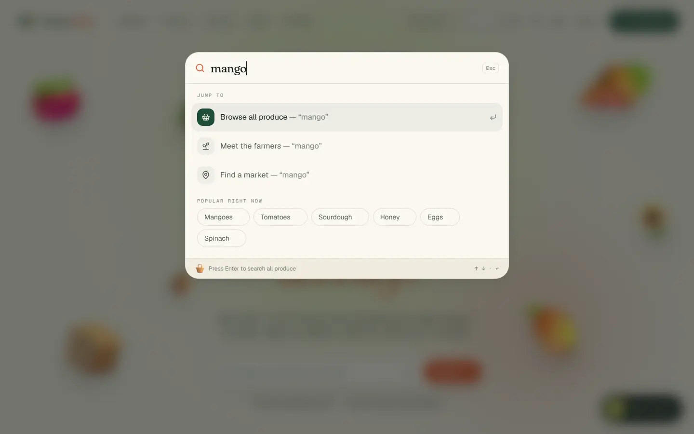 |
| **Customer dashboard** | **Farmer dashboard** | **Admin dashboard** |
| 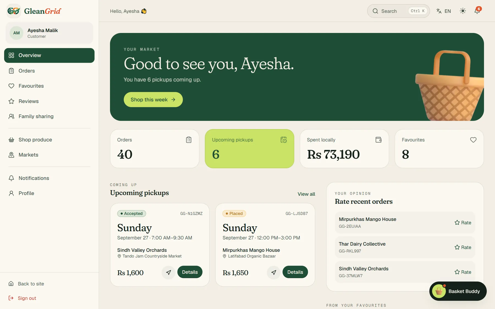 | 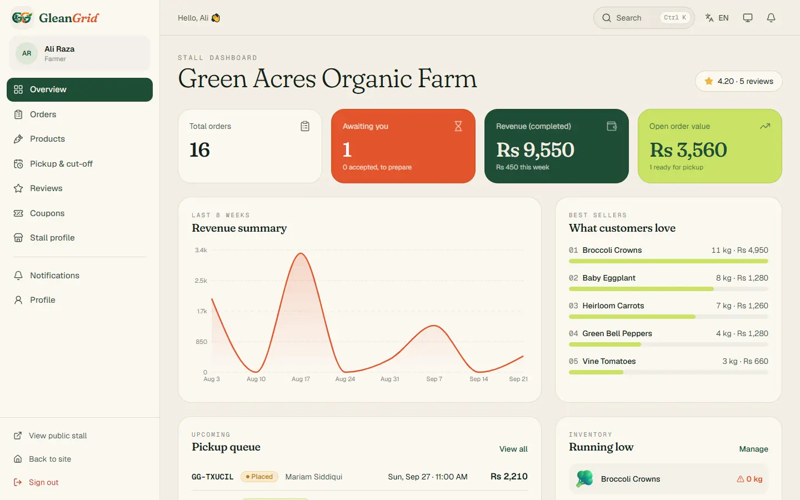 | 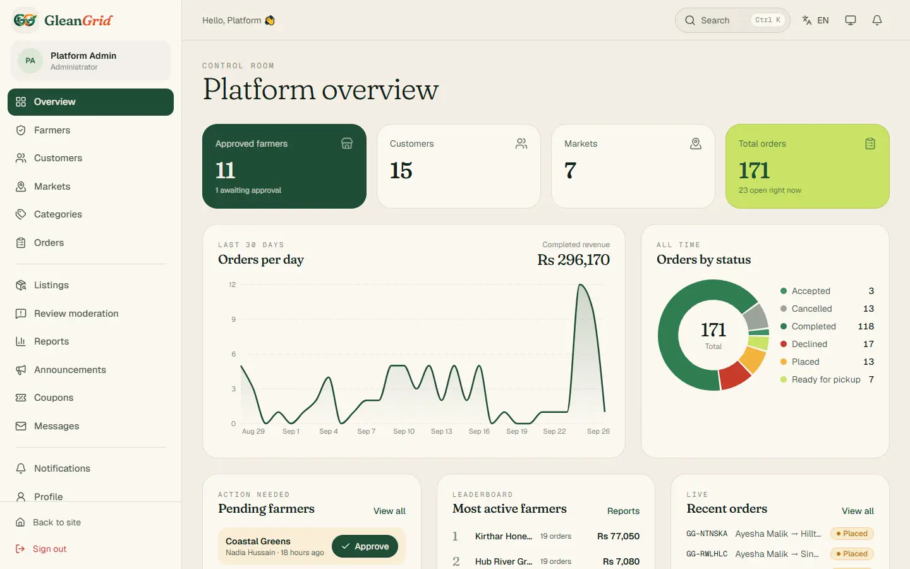 |

<p align="center">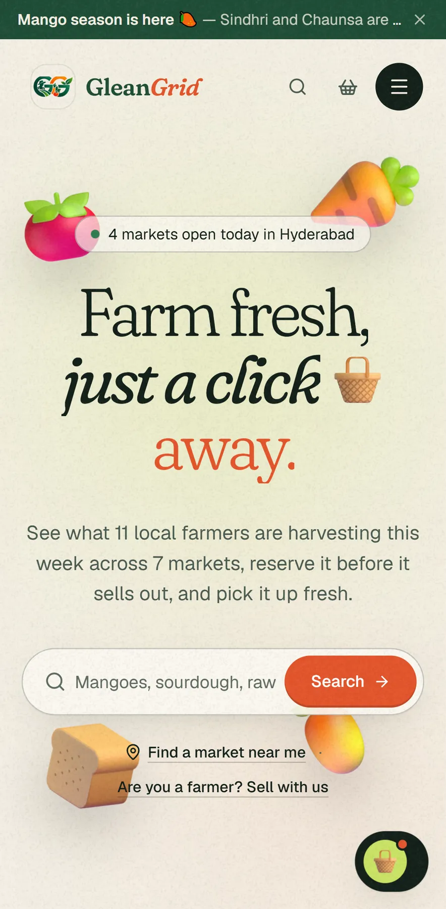 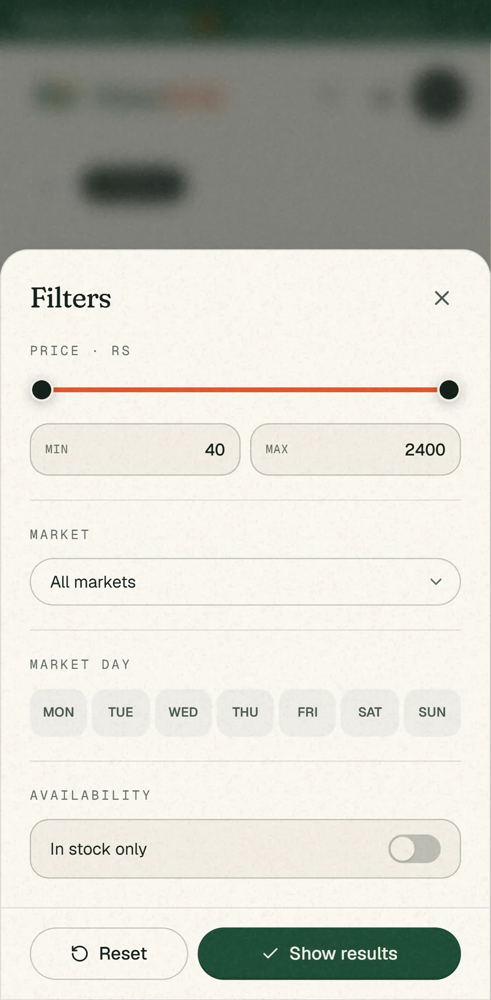 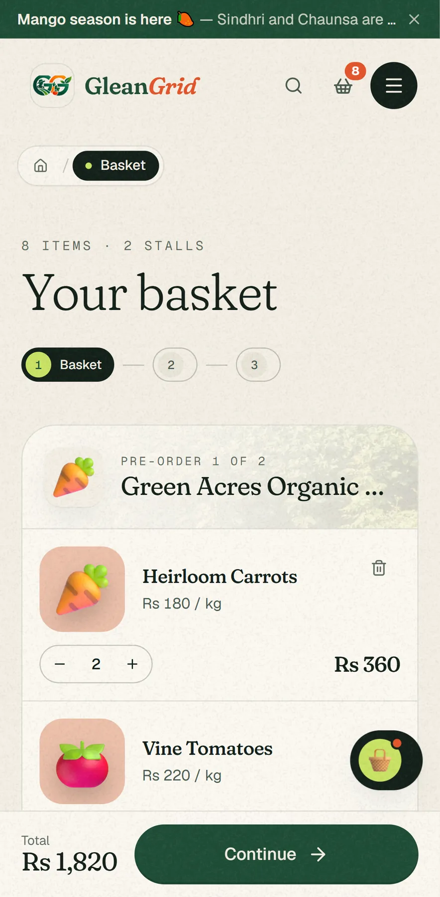 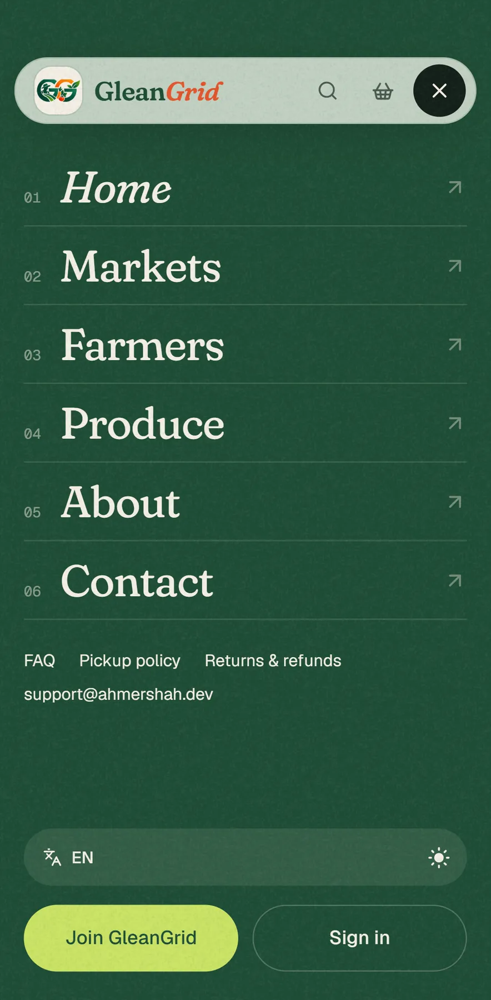</p>

## Features at a glance

| For customers | For farmers | For administrators |
|---|---|---|
| Live market map, *open today* and *near me* | Stall profile with map pin, markets and stall numbers | Platform KPIs, 30-day trends, system health |
| Produce search (⌘K) and filters: category rail with counts, price slider, market, market day, in-stock switch (a bottom sheet on phones) | Products with photos, units, weekly stock template | Approve / suspend stalls with a reason |
| Guest basket grouped by stall, with the next pickup time, undo on remove and a sticky checkout bar on phones | Sold-out and temporarily-unavailable states | Activate / deactivate customers |
| One pre-order per farmer, pickup window per order | Pickup windows with capacity, one cut-off for all | Markets (days, hours, coordinates) and categories |
| Modify / cancel until cut-off, reorder in one tap | Accept → ready → complete, decline with a note | Listing and review moderation |
| Order code, directions, call / WhatsApp / e-mail the farmer | Revenue, pipeline, best sellers, low-stock alerts | Reports with CSV export and a report history |
| Favourites, **“Notify me when it’s back”** alerts, family sharing | Public replies to reviews | Coupons, announcements, contact inbox with replies |
| **Online payments** — Easypaisa, JazzCash, card (3D animated card, wallet approval screen) with automatic refunds | “Paid online” vs “collect at pickup” on every order | **Payments** console with timelines and one-click refunds, per-method switches |
| **Price-history charts** (1M / 3M / 6M, low, high, 30-day average) and a **seasonal calendar** | **Badges**: Top Rated, Reliable Pickups, Rising Star, Customer Favourite | **Badge rules** (tunable thresholds, Bayesian score) with manual award / revoke / unlock |
| **Photo reviews** (up to 4 photos) with a lightbox and a rating histogram | Review photos shown on your stall and products | **Seasonal calendar** editor and **review-photo** moderation |
| **Sign in with Google or Facebook** | Farmer sign-up with Google / Facebook too | Everything recorded in the audit log |
| Reviews for farmers and products after pickup | Stall coupons | Failed-sign-in and suspicious-IP panel |
| Real photos for every product with the 3D illustration as a sticker, and a Photo / 3D switch | Stock edits that never erase sales made while the form was open | Platform settings, audit log and order overrides |
| **Basket Buddy** — tap-only, personal assistant: *my orders, tracking, basket, favourites, payments, spending*; never reveals other users | Basket Buddy: today’s pickups, orders to accept, low stock, rating & badges | Basket Buddy: what needs attention |
| 8 languages, light/dark | E-mail + in-app notifications | Every order across all markets |

**Experience details:** pinned horizontal galleries that slide sideways as you scroll down (“Soil, sun and early mornings”, “Meet the people behind your food”), instant page changes (links prefetch on hover or touch), optimistic favourites that fly into — and back out of — the header heart, fly-to-basket, a magnetic back-to-top medallion, a sun/moon theme switch that spreads from the toggle, a slim custom scrollbar, smooth scrolling and a custom cursor, all switched off for people who prefer reduced motion. URLs are forgiving: `/Contact`, `/FAQ`, `/contact-us`, `/tos` or `/refund-policy` redirect (301) to the canonical lowercase page.

## SRS coverage

Every functional requirement in the *MarketLink SRS v1.0* is implemented. Where the brief was optional, it is implemented anyway.

| SRS requirement | Where it lives |
|---|---|
| **Customer** registration with name, phone, e-mail, address; secure login | `Auth/Register`, `Auth/Login`; e-mail proven with a 6-digit code |
| Multiple favourite farmers & products | Heart on any product/stall/market → `Customer/Favorites` |
| Family account sharing *(optional)* | `Customer/Family` — invite, accept, household orders & reorder |
| Browse markets by location & day; farmers at each market | `Markets/Index` (map, day filter, *near me* distance sort), `Markets/Show` |
| Farmer profile: stall, location, days, weekly stock | `Farmers/Show` |
| Embedded map with markers and directions | Leaflet + OpenStreetMap everywhere; route from your location (OSRM); Google Maps / OSM direction links |
| Browse categories; filter by price, category, market, day | `Products/Index` |
| Product details: price, unit, quantity, farmer | `Products/Show` |
| Cart → pre-order against farmer stock | Basket (guest-friendly) → `Customer/Checkout`, stock reserved with row locks |
| Choose pickup date & slot within farmer windows | Checkout shows only bookable, non-full windows |
| Order status placed → accepted → ready → completed; cancel/modify before cut-off | `Customer/Orders/*`, enforced server-side |
| No payment gateway — pay at pickup | By design; no card data anywhere |
| View / modify / cancel orders | `Customer/Orders/Show`, `Customer/Orders/Edit` |
| Past orders and quick reorder | Order history + one-tap reorder |
| Favourites with restock alerts | E-mail + in-app alert when a favourited item is back |
| Save preferred markets; route-friendly pickup details | Favourite markets; directions from the dashboard |
| **AI assistant** *(optional)* | **Basket Buddy** — guided questions + free text, answers from live data |
| Rate & review farmers and products after completion; read reviews before ordering | Reviews on completed orders; shown on stall & product pages |
| **Farmer** registration: stall, contact person, phone, e-mail, address | `Auth/Register` (farmer tab) |
| Profile: markets, days, pickup windows, address, map pin, lat/lng | `Farmer/Stall`, `Farmer/Slots` (drop a pin on the map) |
| Add / edit / view / delete products with category, price, unit, qty, description, image | `Farmer/Products/*` |
| Recurring weekly stock template | *Apply weekly template* resets every listing to its usual quantity |
| Mark sold out / temporarily unavailable | Status toggle on each product |
| View, accept, decline, mark ready; set cut-off; manage slots | `Farmer/Orders/*`, `Farmer/Slots` |
| Order history, best sellers, total/pending orders, revenue summary | `Farmer/Dashboard` (8-week revenue chart) |
| Respond to reviews | `Farmer/Reviews` |
| **Admin** dedicated dashboard with platform totals | `Admin/Dashboard` + sign-in security panel |
| Approve / suspend farmers; activate / deactivate customers | `Admin/Farmers/*`, `Admin/Customers` |
| Add / edit / remove markets incl. days, timings, coordinates, map links | `Admin/Markets/*` |
| Remove inappropriate listings and reviews | `Admin/Moderation/*` |
| Reports: total orders, revenue by market, most active farmers | `Admin/Reports` + CSV export (only on click) |
| Master data (categories) and announcements | `Admin/Categories`, `Admin/Announcements` |
| Role-based access control | `role:` middleware on every area + ownership checks |
| Search / sort / filter with map results | Markets, farmers and products; ⌘K global search |
| Responsive design | Mobile-first Tailwind layouts |
| E-mail or in-app notifications (confirmation, ready for pickup) | Both — database notifications + branded e-mail |
| About Us (team & platform) · Contact Us with Google Maps | `About`, `Contact` (Google Maps embed) |

**Beyond the brief:** e-mail OTP verification, new-device sign-in alerts, session management, Argon2id hashing, CSP with nonces, reCAPTCHA v3/v2 + honeypot, FAQ and four policy pages, JSON-LD structured data, `llms.txt`, 8 languages, dark mode, and the motion design details (custom cursor and scrollbar, fly-to-basket, ⌘K search, smooth scroll).

## Tech stack

| Layer | Choice | Why |
|---|---|---|
| Backend | **Laravel 12**, PHP 8.2 | Mature routing, ORM, queues, notifications, validation, rate limiting |
| Bridge | **Inertia.js 3** + Ziggy | Server-side routing and auth with an SPA feel — no separate API to secure |
| Frontend | **React 19**, **Tailwind CSS 4**, Vite 8 | Component model, utility CSS with design tokens, fast builds |
| Motion | Motion (Framer Motion), Lenis | Spring physics, layout animations, smooth scrolling |
| Maps | Leaflet + OpenStreetMap, OSRM routing, Google Maps embed | Free, keyless, meets the SRS map requirement |
| Charts | Recharts | Dashboard and report charts |
| Database | **MySQL 8 / MariaDB 10.4+** (XAMPP) | Relational integrity, CHECK constraints, views |
| Mail | Laravel notifications, branded Markdown theme | Queued, sent after commit |

## Architecture

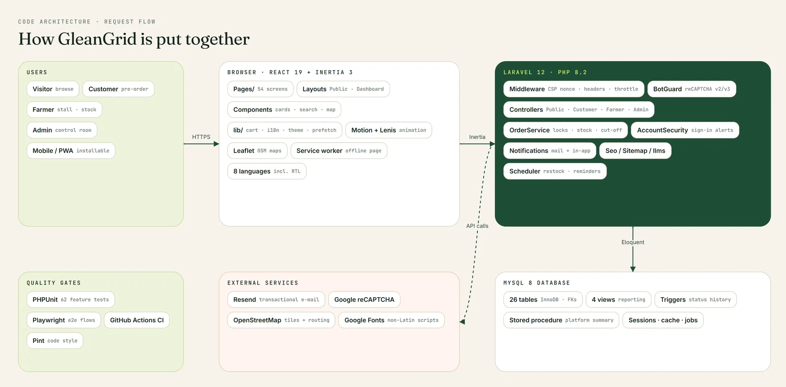

A classic multi-tier web application, as the SRS asks, organised so each layer has one job:


**Design decisions that keep it scalable:**

- **Thin controllers, fat services.** Anything with business rules or concurrency (placing, modifying, cancelling and transitioning orders; verification codes; sign-in auditing) lives in a service and is unit-testable without HTTP.
- **One source of truth per concern.** SEO copy lives in `App\Support\Seo` and is rendered server-side *and* reused by React. Policy and FAQ text lives in `App\Support\LegalContent` and feeds the pages, `llms-full.txt` and FAQ structured data.
- **Queued, after-commit notifications.** Set `QUEUE_CONNECTION=database` and run a worker, and no request waits on SMTP. A rolled-back order never sends an e-mail.
- **Persistent layouts.** The header, footer, smooth scroll and cursor stay mounted between visits; only the page swaps. This is why navigation feels instant.
- **Stateless web tier.** Sessions, cache and queue sit behind drivers (database by default). Switch them to Redis and put several app servers behind a load balancer, with no code changes.
- **Database does its share.** Composite indexes match the real dashboard queries, reporting views pre-join heavy aggregates, and CHECK constraints reject impossible data even if a bug slips past PHP.
- **Cached public artefacts.** The sitemap is cached for an hour; static assets are fingerprinted by Vite for long-lived caching.

## Database design

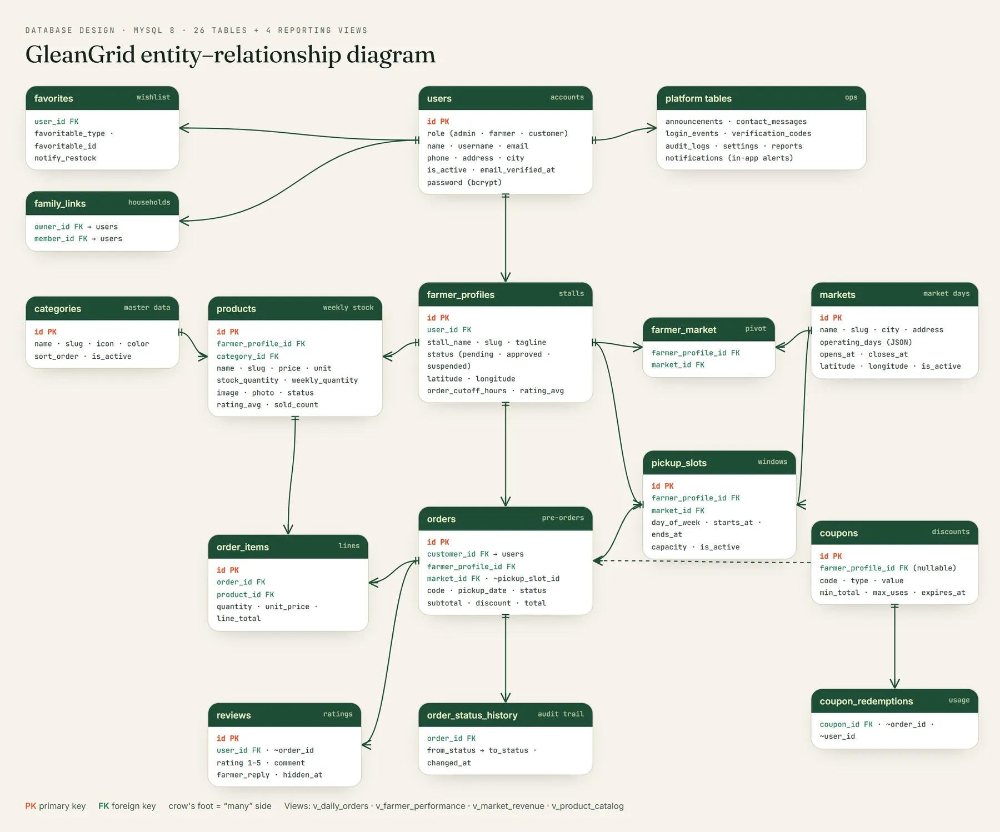

26 tables (plus 4 views), drawn above.


- **Keys & integrity:** every relationship is a real foreign key with an explicit `ON DELETE` rule (cascade, restrict or set null, chosen per relation). Unique keys stop duplicate usernames, e-mails, slugs, favourites, stall-market links and reviews-per-order.
- **Indexes:** composite indexes match the queries dashboards actually run, e.g. `orders(customer_id, status, pickup_date)`, `orders(farmer_profile_id, status, pickup_date)`, `orders(pickup_slot_id, pickup_date, status)` for capacity checks, and `products(farmer_profile_id, status, removed_at)`.
- **CHECK constraints (22):** ratings 1–5, prices ≥ 0, quantities > 0, valid status values, `closes_at > opens_at`, a pickup window’s end after its start, no self family links, valid latitude and longitude.
- **Views:** `v_market_revenue`, `v_farmer_performance`, `v_product_catalog` and `v_daily_orders`, built on joins and used for reporting.
- **Snapshots:** `order_items` copies the product name, unit and price at order time, so history stays correct when a farmer edits a listing.
- **Polymorphism with a morph map:** favourites and reviews point at products, farmers or markets using short type names (`product`, `farmer`, `market`).

**SQL scripts** (SRS deliverable): `database/sql/01_schema.sql` (structure, keys, constraints, views) and `database/sql/02_seed_data.sql` (demo data). Both import cleanly into an empty MySQL/MariaDB database. The Laravel migrations remain the source of truth.

## Security

| Threat | Defence |
|---|---|
| Password theft | **Argon2id** (64 MiB, 4 passes). Old bcrypt hashes upgrade on next sign-in. The policy requires upper- and lower-case letters, a number and a symbol; production also rejects known-breached passwords. |
| Credential stuffing / brute force | Per-account + IP lockout with growing cool-downs, named rate limiters on every public write, and a failed-login audit trail with a suspicious-IP panel for admins |
| Bots & spam | Honeypot field, a minimum-time trap, and Google reCAPTCHA: the **v2 “I’m not a robot” checkbox** is required on sign-up, contact and both password-reset forms, while sign-in uses invisible **v3** scoring that escalates to the checkbox on a low score. One script load serves both versions. The published demo accounts skip Google (their passwords are public anyway) but keep the honeypot and lockout. |
| Account takeover | 6-digit e-mail codes (hashed, single-use, 15-minute life, 5 attempts, row-locked), new-device sign-in e-mails, password-change e-mails, and *sign out other devices* |
| XSS | React escaping by default, plus a **nonce-based Content-Security-Policy** with `strict-dynamic`, `object-src 'none'` and `base-uri 'self'` |
| CSRF | Laravel CSRF tokens on every state-changing request (Inertia sends the XSRF header automatically) |
| Clickjacking & sniffing | `frame-ancestors 'self'`, `X-Frame-Options`, `X-Content-Type-Options`, `Referrer-Policy`, `Permissions-Policy`, `X-Permitted-Cross-Domain-Policies`, HSTS and `upgrade-insecure-requests` over HTTPS only. `Cross-Origin-Opener-Policy` is opt-in (`SECURITY_COOP=true`) because it stops Lighthouse/PageSpeed from tracing the page. |
| Session fixation / hijacking | Session ID regenerated on sign-in, encrypted, `HttpOnly`, `Secure`, `SameSite=Lax` cookies; database sessions users can revoke |
| Account enumeration | Password-reset answers the same way whether the e-mail exists or not |
| Broken access control | `role:` + `verified` middleware on every private area, plus ownership checks on orders, reviews and family links |
| SQL injection | Every query goes through PDO prepared statements (Eloquent / query builder bindings); the few raw fragments are fixed strings or use `?` placeholders |
| Floods, DoS and scrapers | A site-wide limiter on every page (300 requests a minute per IP for guests, 600 per signed-in account) on top of the per-form limits; writes are capped at 60 a minute per account while page views stay free. Set `TRUSTED_PROXIES` when running behind Cloudflare or a load balancer so limits apply to the real visitor IP, not the proxy |
| Duplicate-value races | If two people claim the same username, e-mail or coupon code at the same instant, the database's unique index decides and the loser gets a normal form error instead of a server error |
| Card data | Card numbers and CVCs are validated (Luhn, expiry, CVC length) and passed to the gateway but **never stored, logged or flashed back** to the session — only the brand and last four digits are kept. The fields are excluded from exception flashing (`dontFlash`). Wallet numbers are masked (`0300•••4567`). |
| Payment tampering & forged callbacks | Amounts are always recomputed on the server from the orders. Gateway callbacks are CSRF-exempt but must carry a valid **HMAC-SHA256 signature** (compared in constant time) and a matching amount, otherwise they are rejected with 403/422. A payment page or status endpoint for someone else’s payment returns 404. |
| Payment abuse | Dedicated limiters: 8 payment attempts a minute and 40 an hour per account, 5 attempts per checkout, 90 status polls a minute. Payment windows expire and release stock automatically. |
| OAuth (Google / Facebook) | The OAuth `state` parameter (Socialite) blocks login-CSRF; only providers on an allow-list are routable; unverified provider e-mails are refused; a social identity can belong to one user only. **Pre-account-takeover** is blocked: if someone registered your e-mail but never verified it, signing in with Google proves ownership, so that unverified password is wiped and all its sessions are killed. Profile photos are fetched only over HTTPS from Google/Facebook CDN hosts (every redirect re-checked — no SSRF), size-capped and re-encoded to WebP. The last sign-in method can’t be disconnected. |
| Assistant data leaks & prompt injection | Basket Buddy accepts **only whitelisted intent keys** — no free text reaches the server, so there is nothing to inject. Every personal answer is built from `$request->user()` alone; the request cannot name another user, and the chat history is kept per user in the browser. |
| Unsafe downloads | CSV exports are generated only on an explicit click (SRS non-functional requirement) |
| Malicious uploads | Photos are shrunk and converted to WebP **in the browser** before upload, then the server checks the real MIME type, dimensions and pixel count, decodes and **re-encodes** the pixels with GD (dropping EXIF/GPS and anything hidden after the image data), and stores them under a random name. SVG is never accepted. Users can remove a photo; nothing is deleted until they save. |
| Lost work | Profile, stall, product and contact forms warn before an in-app link, refresh or tab close would discard unsaved changes. Every delete asks for confirmation first. |

## Concurrency & race conditions

Farmers-market mornings are bursty: many shoppers reserve the same limited stock at once. Every one of these interleavings is handled, and each is covered by `tests/Feature/RaceConditionTest.php`:

| Race | What could go wrong | How it’s prevented |
|---|---|---|
| Two shoppers buy the last items | Stock oversold | `SELECT … FOR UPDATE` on the products, rows locked in id order (no deadlocks), stock checked and decremented inside one transaction |
| Two bookings hit a nearly full pickup window | Capacity exceeded — row locks on *orders* can’t stop two inserts into an empty range | The **pickup-slot row itself is locked**, so all bookings for that window are serialised |
| Double-click on *Place order* / two tabs | Duplicate orders | A per-customer atomic cache lock around checkout |
| Customer cancels while farmer accepts | Stock released twice, or an accepted order silently cancelled | Order re-read `FOR UPDATE` and status re-checked inside the transaction for cancel, modify and every farmer transition |
| Same product twice in one request | Stock check passes per line but the total exceeds stock | Lines merged before the check |
| Double-tap on the heart | Duplicate favourites / flicker | Atomic `DELETE`, then `INSERT IGNORE` backed by a unique index |
| Parallel reviews | Stale average rating | Rating recomputed with a single `UPDATE … SET avg = (SELECT …)` |
| Parallel OTP guesses | Extra guesses; attempt counter lost on rollback | Code row locked; the decision is made inside the transaction but the error thrown **after** commit, so failed attempts persist |
| Many buyers hit a pickup window at once | A stale snapshot: under MySQL’s REPEATABLE READ, a plain `COUNT` after waiting for a lock still sees the data from before the wait | The booking count is a locking read (`FOR UPDATE`), which always sees the latest committed orders |
| A farmer saves the stock form while customers are buying | The farmer’s old number overwrites the sales made meanwhile (a lost update), so the stall oversells | The form sends the stock it showed; the server locks the product and subtracts anything sold since, and leaves stock alone if the field wasn’t changed |
| Monday restock / *Apply weekly template* runs during a checkout | A read-then-save loop overwrites a reservation made in between | One atomic `UPDATE … SET stock_quantity = weekly_quantity` per run, no read-modify-write |
| Double-tap on *Pay* / two tabs paying the same checkout | Charged twice | The payment row is locked `FOR UPDATE`; it moves `pending → processing` exactly once; each attempt carries a **one-time idempotency key** stored under a unique index, so a replayed request returns the existing result instead of charging again |
| Gateway confirms after the payment window closed | Money taken for orders that were already released | The late capture is detected (payment no longer `processing`) and **refunded automatically**, with a `late_capture` event in the timeline |
| Customer cancels while the payment is in flight | Order cancelled but still charged | Orders awaiting payment can only be released through the payment (all-or-nothing); paid orders refund through a conditional `UPDATE … WHERE payment_status = 'paid'`, so a refund can never run twice |
| Two restocks fire at once | Two “back in stock” e-mails | Each alert is claimed with `UPDATE … SET notified_at = NOW() WHERE notified_at IS NULL`; only the process that wins the row sends it |
| Admin revokes a badge while the nightly job runs | Badge silently re-awarded | Badge rows are locked during recompute and manual decisions are **locked** so the job leaves them alone |
| Deadlocks under load | Request fails | Transactions retry up to 3 times (`DB::transaction(..., attempts: 3)`) |
| Notifications for rolled-back work | “Back in stock” / “order placed” e-mails for things that never happened | Notifications are dispatched **after commit** |

**Proven with real parallel processes:** `php tests/Stress/checkout-race.php 50` fires 50 separate PHP processes at checkout at the same instant, against the real MySQL database: one item left in stock, a coupon that can be used once, a pickup window with room for three, and one buyer double-submitting. Every run ends with exactly 1 sale, 1 coupon use, 3 bookings, 0 crashes and 0 negative stock, and the script cleans up after itself.

A MariaDB quirk found during testing is also documented in the migration. The first non-null `TIMESTAMP` column in a table silently gets `ON UPDATE CURRENT_TIMESTAMP`, which reset the code expiry on every guess. Expiry and report dates now use `DATETIME`.

## Online payments

Checkout offers **Cash at pickup**, **Easypaisa**, **JazzCash** and **Debit / credit card** (each can be switched off in *Admin → Settings*).

1. Placing an online order reserves the stock and creates one `payments` row for the whole checkout (one payment can cover orders from several stalls). Farmers aren’t notified and can’t accept the order until it is paid.
2. The customer lands on the payment page: a 3D card that tilts with the pointer and flips to show the CVC, or a phone that shows the wallet approval request. A countdown shows how long the stock is held (default 20 minutes).
3. **Card:** validated (Luhn, expiry, CVC) → charged → `paid`. **Wallets:** a payment request goes to the phone → the page polls → `paid` once approved.
4. When paid, every order in the checkout becomes `paid`, farmers get their *New pre-order* e-mail and the customer gets a receipt.
5. Unpaid checkouts are released by `gleangrid:expire-payments` (scheduled every minute): the stock goes back on sale and coupons are returned.
6. Refunds are automatic when the customer cancels before the cut-off or the farmer declines. Admins can refund any payment from *Admin → Payments*, which also shows each payment’s full event timeline (attempts, declines, captures, refunds, IPs).

**Gateways.** `PAYMENTS_MODE=sandbox` (the default) runs a built-in simulator so the whole flow can be judged without real money. Test data is shown on the payment page: `4242 4242 4242 4242` approves, `4000 0000 0000 0002` is declined, `4000 0000 0000 9995` has no funds; any `03XXXXXXXXX` wallet number approves after a few seconds and numbers ending in `0000` are declined. With `PAYMENTS_MODE=live` and `JAZZCASH_MERCHANT_ID`, `JAZZCASH_PASSWORD` and `JAZZCASH_INTEGRITY_SALT` set, JazzCash uses its hosted checkout (`pp_SecureHash` HMAC-SHA256, verified again on the signed callback). Live Easypaisa and card acquiring need a merchant agreement; they plug into the same `App\Payments\PaymentGateway` interface and stay hidden in live mode until a driver is configured.

## Social sign-in (Google & Facebook): what we store

Set `GOOGLE_CLIENT_ID`, `GOOGLE_CLIENT_SECRET`, `FACEBOOK_CLIENT_ID` and `FACEBOOK_CLIENT_SECRET` (callback URLs: `https://YOUR-DOMAIN/auth/google/callback` and `/auth/facebook/callback`). The buttons appear on *Sign in* and on the first step of *Join* (as a customer or a farmer).

| Field | Where it comes from | What we store |
|---|---|---|
| **Name** | Provider profile name | `users.name` — the customer can edit it at onboarding and in their profile |
| **E-mail** | Provider e-mail, only if the provider says it is **verified** (Google `email_verified`; Facebook only returns confirmed e-mails) | `users.email`, and `email_verified_at` is set immediately — no six-digit code needed. If Facebook returns no e-mail (the user declined the permission), sign-up is refused with a clear message. |
| **Profile photo** | Provider avatar URL (Google 512 px, Facebook large picture) | Downloaded once over HTTPS from Google/Facebook hosts only, re-encoded to WebP and stored as `users.avatar` — we never hot-link the provider, and never overwrite a photo the user already chose |
| **Phone number** | Not provided by Google/Facebook | `users.phone` stays empty until the user fills the **Complete your profile** step, which is required (with address and the terms) before they can order or open a stall. Farmers also enter their stall name there. |
| **Password** | Never shared by Google/Facebook | `users.password` is **NULL** — nobody can sign in with a password for that account until the user sets one under *Profile → Set a password* (no current password asked). Password sign-in with an empty hash always fails. |
| **Provider identity** | Provider’s stable user ID | `social_accounts` (`provider`, `provider_user_id`, provider e-mail, `last_used_at`), unique per provider identity **and** per user + provider. We do **not** store access or refresh tokens. |
| **Username** | Derived from the e-mail’s local part | `users.username`, made unique automatically |

**Linking rules.** A returning provider identity signs straight in. A new identity whose verified e-mail matches an existing account is linked to it (and the owner gets an e-mail); if that account was never verified, its password is wiped and its sessions revoked (pre-hijack protection). From *Profile → Connected accounts* users can connect or disconnect Google/Facebook; the last remaining sign-in method can’t be removed. Account deletion removes the linked identities too.

## Badges, price history, seasons, photo reviews & alerts

- **Stall badges** are recalculated nightly by `gleangrid:badges` (and on demand from *Admin → Stall badges*). **Top Rated** uses a Bayesian average — `score = v/(v+m)·R + m/(v+m)·C` where *R* is the stall’s average rating over stall + product reviews, *v* the review count, *C* the platform average and *m* the prior weight (default 5) — and needs score ≥ 4.5 with ≥ 5 reviews. **Reliable Pickups** needs ≥ 10 completed orders in 90 days and ≥ 95 % fulfilled (completed ÷ completed + declined). **Rising Star**: joined within 120 days with ≥ 3 reviews averaging ≥ 4.5. **Customer Favourite**: saved by ≥ 10 shoppers. Every threshold is editable; admins can award or revoke any badge by hand, which locks it against the nightly job until they return it to automatic.
- **Price history.** Every price change is recorded (`product_price_history`, one row per product per day). Product pages chart 1, 3 or 6 months with the low, high and 30-day average and tell shoppers when a price is below its average. Basket Buddy lists the biggest recent price drops.
- **Seasonal calendar** (`/seasonal-calendar`). A month-by-month harvest calendar for Sindh (31 crops seeded, peak months highlighted) with a month dial, “coming next month / last chance” lists and a full grid. Admins manage it under *Admin → Seasonal calendar*; product pages show an *In season / Peak season* chip.
- **Photo reviews.** Up to 4 photos per review, compressed in the browser and re-encoded on the server (EXIF/GPS stripped). Reviews show a star histogram and a *With photos* filter with a keyboard-friendly lightbox. Admins can hide or delete single photos.
- **Back-in-stock alerts.** *Notify me when it’s back* on any sold-out product sends one in-app notification and one e-mail when the farmer restocks (including the weekly template and the Monday restock job), then switches off.

## SEO, performance & accessibility

- **Per-page titles (40–60 characters) and descriptions (150–160 characters)**, written by hand for static pages and composed from whole sentences for markets, stalls and products (no mid-word truncation). They are server-rendered, so crawlers see them without JavaScript.
- **Clean URLs everywhere, no `?` or `=`.** Filters, search, sorting and pages are readable path segments: `/products/category/fruits/price/100-500/sort/price-low/page/2`, `/farmers/search/honey`, `/markets/day/sunday`, `/register/farmer`. One rule set (`App\Support\PathFilters` in PHP, `resources/js/lib/url.js` in React) builds and parses them, old query-string links redirect permanently (301) to the clean form, segments are put in one canonical order, and filtered or paginated listings point their canonical URL at the plain listing (category pages stay indexable and are in the sitemap). Password-reset e-mails no longer put the address in the link.
- Canonical URLs, Open Graph and Twitter cards with a **1200×1200** share image, `robots` directives (`noindex` on private areas), `robots.txt` and a live **`/sitemap.xml`**.
- **JSON-LD:** Organization, WebSite with site search, Product (offer, pickup, rating), Place (opening hours, geo) for markets, LocalBusiness for stalls, and FAQPage.
- **`/llms.txt` and `/llms-full.txt`** for AI assistants, generated from live data with `php artisan gleangrid:llms`.
- Images: the logo went from 665 KB PNG to 40 KB WebP, the team photo from 1.8 MB to 19 KB, the favicon SVG from 1 MB to 4 KB, and the 65 produce illustrations from 2.1 MB of PNG to 301 KB of WebP.
- JavaScript: only English ships in the main bundle; each other language is a separate chunk fetched on first use. Leaflet maps load when they approach the viewport, the Basket Buddy assistant loads when the browser is idle, and axios was replaced with a 20-line `fetch` helper.
- **PWA:** installable (manifest with shortcuts), with a service worker that caches hashed assets, images and fonts and shows a branded offline page. HTML is never cached, because every page carries a fresh CSP nonce and the signed-in user’s data.
- **Lighthouse 13** (local run; mobile is simulated slow 4G with a 4× slower CPU): Accessibility, Best Practices, SEO and Agentic Browsing score **100** on the public pages. Performance is 70–94 on desktop and 34–71 on mobile. Pages are server-rendered with Inertia SSR when the SSR process runs (`npm run build` builds both bundles, `npm run ssr` starts it); without it the site falls back to client rendering, which is what costs mobile Performance. Sign-in pages score lower on SEO on purpose, because private pages are `noindex`.
- Code-split pages, prefetching, fingerprinted assets, lazy images, and web fonts that never block the first paint.
- **Search:** a ⌘K / Ctrl K / `/` palette with live results grouped into produce, farmers and markets. Every typed word must match, results are ranked (exact, then prefix, then word start, with in-stock items first), matches are highlighted, and misspellings get a “did you mean” suggestion (“tomatos” → “tomatoes”). It keeps recent searches on the device, scopes switch with Tab, and it follows the ARIA combobox pattern.
- Accessibility: semantic landmarks, a skip link, visible focus rings, `aria-*` on interactive widgets, full keyboard support (⌘K / `/` search, arrow keys, Esc), `prefers-reduced-motion` respected everywhere. The custom cursor steps aside for text fields and native grab cursors.

## Internationalisation

English, **Urdu** (RTL), **Arabic** (RTL), Hindi, Russian, Chinese, Spanish and French. Every locale has **100% key coverage** with matching `:placeholders` (checked by script). Direction, fonts per script, number, date and currency formatting all follow the chosen language. Legal pages are published in English as the governing version, and the page says so in the other languages.

## Running locally (XAMPP)

Requirements: PHP 8.2+ (with `pdo_mysql`, `mbstring`, `openssl`, `gd`; Argon2 support is standard in XAMPP builds), Composer, Node 20+, MySQL/MariaDB (XAMPP).

**Quick start** — after creating an empty `gleangrid` database:

```bash
composer setup          # install, create .env, generate a key only if none exists, migrate, build
php artisan db:seed     # demo markets, farmers, produce, orders and accounts
composer dev            # server + queue + logs + Vite, side by side
```

**Step by step:**

```bash
git clone <repo> gleangrid && cd gleangrid
composer install
npm install
cp .env.example .env            # then set APP_ENV=local, APP_DEBUG=true, APP_URL=http://127.0.0.1:8000, MAIL_MAILER=log
php artisan key:generate
# create an empty database called `gleangrid` in phpMyAdmin, then:
php artisan migrate --seed      # or import database/sql/01_schema.sql + 02_seed_data.sql
php artisan storage:link
npm run build                   # or `npm run dev` while developing
php artisan serve               # http://127.0.0.1:8000
```

With `MAIL_MAILER=log`, verification codes and every other e-mail are written to `storage/logs/laravel.log`.

**PHP extensions:** enable `extension=gd` (WebP re-encoding of uploads) and `zend_extension=opcache` with `opcache.enable=1` in `C:\xampp\php\php.ini`. Restart Apache or `php artisan serve` afterwards.

**reCAPTCHA:** in the Google reCAPTCHA admin console, add `localhost`, `127.0.0.1` and your production domain to **both** keys (v3 and v2). See [Troubleshooting](#troubleshooting) if the box doesn’t appear.

**Demo accounts** (already verified):

| Role | E-mail | Password |
|---|---|---|
| Customer | `customer@gleangrid.test` | `Customer@123` |
| Farmer | `farmer@gleangrid.test` | `Farmer@123` |
| Admin | `admin@gleangrid.test` | `Admin@123` |

On the sign-in page, the three **demo tiles sign in with one tap**. Every `…@gleangrid.test` account counts as verified and never receives e-mail (those inboxes don’t exist), but still gets in-app notifications.

## Troubleshooting

| Symptom | Cause | Fix |
|---|---|---|
| reCAPTCHA box missing or shows *“ERROR for site owner: Invalid domain”*; sign-in keeps asking for the checkbox | Google treats `127.0.0.1` and `localhost` as different domains. If only `localhost` is on the key, a site opened at `http://127.0.0.1:8000` gets *“Localhost is not supported by default”* | Add **`127.0.0.1`** to both keys in the reCAPTCHA console, or open the site at `http://localhost:8000` |
| Every form says *Page expired (419)* locally | `.env` still has production values (`SESSION_SECURE_COOKIE=true` on plain `http`) | For local work use `APP_ENV=local`, `APP_DEBUG=true`, `APP_URL=http://127.0.0.1:8000`, `SESSION_SECURE_COOKIE=false` |
| *Vite manifest not found* | Assets were never built on this checkout (`public/build` is git-ignored) | `npm ci && npm run build`, or `npm run dev` |
| *No application encryption key* | Empty `APP_KEY` | `php artisan key:generate` (only when the key is empty — changing it logs everyone out) |
| Uploaded photos don’t appear | Missing storage link | `php artisan storage:link` |
| No e-mails arrive locally | No mail provider configured | `MAIL_MAILER=log` and read `storage/logs/laravel.log`; demo `@gleangrid.test` accounts never receive mail by design |
| Changed `.env` but nothing changed | Config is cached | `php artisan optimize:clear` |

## Deploying to production

A complete, step-by-step guide for a **free Oracle Cloud server** (Nginx, PHP-FPM, MySQL 8, the SSR process, the queue worker, the scheduler, Cloudflare HTTPS and DDoS protection, backups and a one-command deploy script) is in the wiki: **[Deployment](https://github.com/ahmershahdev/GleanGrid/wiki/Deployment)**. The short version:

1. `composer install --no-dev --optimize-autoloader && npm ci && npm run build` (builds the client and the SSR bundle).
2. Fill `.env` for production: `APP_ENV=production`, `APP_DEBUG=false`, `APP_URL`, database, `QUEUE_CONNECTION=database`, `SESSION_SECURE_COOKIE=true`, Resend and reCAPTCHA keys, and `TRUSTED_PROXIES` when behind Cloudflare or a load balancer.
3. MySQL 8 with binary logging needs `log_bin_trust_function_creators = 1`, because the migrations create triggers and a stored procedure.
4. `php artisan migrate --force && php artisan storage:link && php artisan optimize` (with OPcache on).
5. Keep `php artisan queue:work` and `php artisan inertia:start-ssr` running under Supervisor, and run `php artisan schedule:run` from cron every minute.
6. After content changes run `php artisan gleangrid:llms`; after schema changes run `php artisan gleangrid:export-sql`.

## Testing & CI

```bash
php artisan test                           # 66 feature tests, 395 assertions
npx playwright test                        # browser end-to-end tests (start the app first)
php tests/Stress/checkout-race.php 50      # real parallel checkouts against MySQL
```

**Feature tests** run against a real MySQL/MariaDB test database (`gleangrid_test`) and cover:

- **Order lifecycle:** place, accept, ready, complete, review; stock, cut-off and pickup-window rules.
- **Security:** OTP flow and attempt limits, honeypot and time trap, password policy, lockout, new-device alerts, bcrypt → Argon2id upgrade, CSP nonce headers, write throttling, friendly duplicate-value errors.
- **Race conditions:** every interleaving in the table above, stale farmer stock edits, the atomic weekly restock, plus the database CHECK constraints.
- **Pages and roles:** every page renders for its role, and each role is blocked from the others.
- **Platform:** reCAPTCHA rules (Google faked), demo-account behaviour, contact topics, live search ranking and typo suggestions, WebP upload and removal, SVG rejection, case-insensitive URLs and aliases, pickup reminders, data export and account deletion.

**End-to-end tests** (`tests/e2e`, configured by `playwright.config.js`) drive the real site in Chrome on desktop and a phone: the public pages and SEO tags, a full customer order from basket to cancellation, and the admin panel. They sign in with the demo accounts and clean up after themselves.

**The stress test** (`tests/Stress/checkout-race.php`) launches up to 50 separate PHP processes at checkout at the same instant: the last item in stock, a single-use coupon, a pickup window with room for three, and one buyer double-submitting. It checks the results in the database and removes its own test data.

**Continuous integration** (`.github/workflows/ci.yml`) runs on every push and pull request: a clean MySQL 8 database, PHP 8.2 and 8.3, `npm ci` + production build (fails if the Vite manifest is missing), Laravel Pint in check mode, the full test suite, and `composer audit` / `npm audit`.

## Project structure

```
app/
  Console/Commands/GenerateLlmsFiles.php   llms.txt + llms-full.txt from live data
  Http/Controllers/{Admin,Customer,Farmer,Auth}/   thin, validated controllers
  Http/Middleware/                          SecurityHeaders (CSP), EnsureRole, EnsureEmailVerified, …
  Models/                                   Eloquent models, scopes and relations
  Notifications/                            queued, after-commit mail + in-app notifications
  Services/                                 OrderService, CouponService, AccountSecurity, AssistantService
  Support/                                  Seo, BotGuard, ImageUpload, LegalContent, Settings
database/
  migrations/                               schema, indexes, CHECK constraints, views
  seeders/DatabaseSeeder.php                Hyderabad demo data
  sql/                                      01_schema.sql, 02_seed_data.sql (deliverable)
resources/
  js/Pages/                                 one React page per screen
  js/Components/                            UI kit, cursor, scrollbar, search, Basket Buddy, maps, charts
  js/i18n/                                  en, ur, ar, hi, ru, zh, es, fr
  views/vendor/mail/                        branded e-mail templates
public/
  images/brand/  images/team/               WebP brand and team images, 1:1 share image
  robots.txt  llms.txt  llms-full.txt  site.webmanifest
tests/Feature/                              OrderFlow, Pages, Security, RaceCondition, Coupon, Platform…
tests/e2e/                                  Playwright browser tests (playwright.config.js)
tests/Stress/checkout-race.php              parallel-process race test against MySQL
docs/images/                                screenshots and diagrams (guides live in the GitHub wiki)
```

## Assumptions

- Payment is settled at the stall; delivery and courier logistics are out of scope (per SRS §1.5).
- Farmer identity, licences and organic or food-safety certification are not verified by the platform (per SRS §1.5); stall approval is a basic admin review.
- One pickup window belongs to one market on one weekday; each window has a capacity set by the farmer.
- Currency is the Pakistani rupee; times are Pakistan Standard Time (`Asia/Karachi` is the IANA zone name).
- Map data comes from OpenStreetMap contributors; the Contact page uses a keyless Google Maps embed as the SRS asks.

## Contributing, security & licence

- **Contributing:** issues and pull requests are welcome — read [CONTRIBUTING.md](CONTRIBUTING.md) for the workflow, coding style and commit conventions.
- **Security:** please report vulnerabilities privately as described in [SECURITY.md](SECURITY.md), not in public issues.
- **Licence:** GleanGrid is open source under the [MIT licence](LICENSE.txt). Third-party assets keep their own licences (see Credits).
- **Wiki:** longer guides for each role, the architecture and the API surface live in the [project wiki](https://github.com/ahmershahdev/GleanGrid/wiki).

## Author & credits

GleanGrid was designed and built solely by **Syed Ahmer Shah** — Software Engineer & Full Stack Developer, Hyderabad, Sindh — covering research, UI/UX, frontend, backend, database, payments, security, DevOps and documentation.
[ahmershah.dev](https://ahmershah.dev/) · [GitHub](https://github.com/ahmershahdev) · [LinkedIn](https://linkedin.com/in/syedahmershah)

Support: **support@ahmershah.dev** · **+92 370 4831994** · Hyderabad, Sindh, Pakistan

**Credits.** Maps © OpenStreetMap contributors (ODbL). Produce illustrations: Microsoft Fluent Emoji (MIT). Photographs: public-domain / CC0 images via Openverse (full list in `public/images/photos/CREDITS.json` and `public/images/photos/products/CREDITS.json`). Fonts: Fraunces and Geist (SIL OFL). Icons: Lucide (ISC).