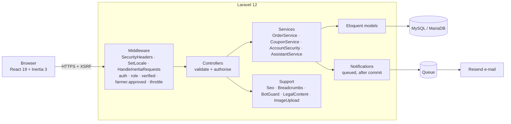

# Architecture

GleanGrid is a classic multi-tier web application (browser → web server → application → database), delivered as a single-page experience through **Inertia.js**: Laravel owns routing, auth, validation and data; React owns rendering. There is no separate public JSON API to secure.

## Request flow

1. The first request returns full HTML: server-rendered `<title>`, meta tags and JSON-LD (from `App\Support\Seo`), plus the page's props as JSON.
2. React boots, reads the props and renders the page inside a **persistent layout** (`PublicLayout` or `DashboardLayout`) — header, footer, smooth scroll and cursor stay mounted.
3. Later clicks are XHR visits that return only JSON props. A delegated listener (`resources/js/lib/prefetch.js`) prefetches a link's props on hover, touch or focus and caches them for 30 s, so most visits render instantly from cache.
4. Mutations (`POST/PUT/PATCH/DELETE`) flush the prefetch cache so nothing stale is shown. Favourites use Inertia's **optimistic updates** and roll back automatically on failure.

## Back end layout

| Folder | Responsibility |
|---|---|
| `app/Http/Controllers/{Customer,Farmer,Admin,Auth}` | Thin controllers per role |
| `app/Http/Middleware` | `SecurityHeaders` (nonce CSP), `EnsureRole`, `EnsureEmailVerified`, `EnsureFarmerApproved`, `SetLocale`, `HandleInertiaRequests` (shared props) |
| `app/Services` | Business rules with transactions and locks: orders, coupons, account security, assistant |
| `app/Support` | Cross-cutting helpers: SEO, breadcrumbs, bot defence, legal copy, image re-encoding |
| `app/Notifications` | Platform notifications (database + mail), verification codes, security alerts |
| `app/Console/Commands` | `gleangrid:llms`, `gleangrid:export-sql` |

## Front end layout

| Folder | Responsibility |
|---|---|
| `resources/js/Pages` | One React page per screen, grouped by role |
| `resources/js/Layouts` | `PublicLayout`, `DashboardLayout`, `AuthLayout` |
| `resources/js/Components` | UI kit (`ui.jsx`), widgets, cards, maps (lazy), charts (lazy), search palette, assistant, breadcrumbs, SEO head |
| `resources/js/lib` | i18n (lazy locales), cart store, theme, fly animation, prefetch, confirm dialogs, image compression, PWA |
| `resources/js/i18n` | Eight dictionaries (`en` bundled; others lazy-loaded) |

## Key design decisions

- **Thin controllers, fat services** — concurrency-sensitive logic is testable without HTTP.
- **One source of truth per concern** — SEO copy, breadcrumbs and legal text are defined once in PHP and reused for HTML, JSON-LD, React and `llms.txt`.
- **Stateless web tier** — sessions, cache and queue are driver-based (database by default; swap to Redis for horizontal scaling).
- **Forgiving URLs** — the 404 handler 301-redirects mixed-case paths (`/Contact`) and common aliases (`/contact-us`, `/tos`, `/refund-policy`) to the canonical page before giving up.
- **Progressive loading** — only English ships in the main bundle; maps, charts, the assistant and other languages are separate chunks loaded on demand.
