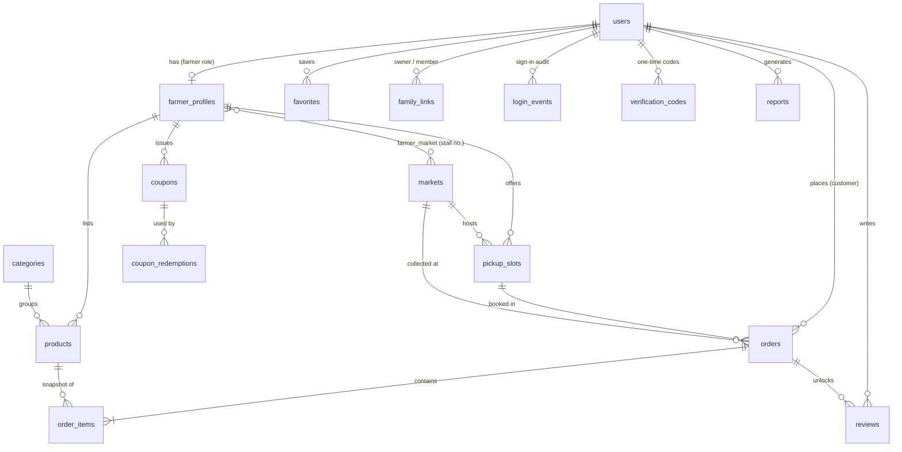

# Database Design

MySQL 8 / MariaDB 10.4+. Laravel migrations are the source of truth; `database/sql/01_schema.sql` and `02_seed_data.sql` are exported deliverables (`php artisan gleangrid:export-sql`).

## Core tables

| Table | Purpose | Notable columns |
|---|---|---|
| `users` | All accounts | `role` (customer/farmer/admin), `status`, `locale`, `email_verified_at`, Argon2id `password` |
| `farmer_profiles` | Stall per farmer | `stall_name`, `slug`, `latitude/longitude`, `operating_days` (JSON), `order_cutoff_hours`, `status`, `rating_avg/count` |
| `markets` | Farmers markets | `operating_days`, `opens_at/closes_at`, `latitude/longitude`, `map_provider` |
| `farmer_market` | Stall ↔ market | `stall_number` |
| `categories` | Master data | `sort_order`, `is_active` |
| `products` | Listings | `price` DECIMAL(10,2), `unit`, `stock_quantity`, `weekly_quantity`, `status`, `removed_at` |
| `pickup_slots` | Pickup windows | `day_of_week`, `starts_at/ends_at`, `capacity`, `market_id` |
| `orders` | Pre-orders | `code`, `status`, `pickup_date`, `cutoff_at`, `subtotal`, `discount_amount`, `total_amount` |
| `order_items` | Lines | name/unit/price **snapshot** at order time |
| `reviews` | Polymorphic reviews | `reviewable_type` (product/farmer), `order_id`, `rating`, `farmer_reply`, `is_hidden` |
| `favorites` | Polymorphic favourites | `notify_restock` |
| `coupons`, `coupon_redemptions` | Discounts | limits, dates, per-customer caps |
| `family_links` | Household sharing | owner, member, status |
| `announcements`, `contact_messages`, `reports` | Admin tools | |
| `login_events`, `verification_codes`, `sessions`, `notifications` | Security & platform | |

## Integrity

- Real foreign keys with an explicit `ON DELETE` rule per relation.
- Unique keys: usernames, e-mails, slugs, one favourite per item, one stall per market link, one review per item per order.
- **22 CHECK constraints** — ratings 1–5, prices ≥ 0, quantities > 0, valid statuses, `closes_at > opens_at`, window end after start, no self family links, valid coordinates.
- Composite indexes matching real queries, e.g. `orders(customer_id, status, pickup_date)`, `orders(pickup_slot_id, pickup_date, status)`.

## Reporting views

`v_market_revenue`, `v_farmer_performance`, `v_product_catalog`, `v_daily_orders`.

## Gotcha worth knowing

On MariaDB the first non-null `TIMESTAMP` column silently gains `ON UPDATE CURRENT_TIMESTAMP`. That reset verification-code expiry on every guess, so expiry and report dates use `DATETIME`.
