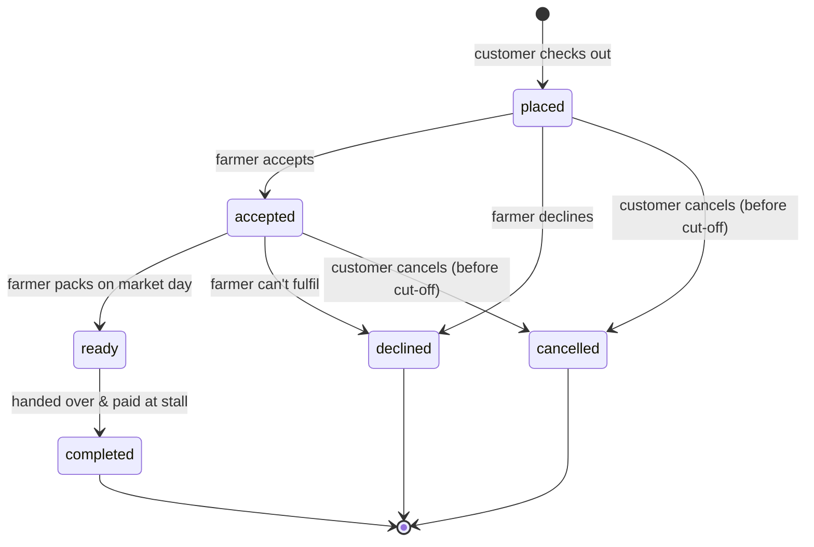

# Order Lifecycle

## 1. Basket

Guests and customers add products to a basket kept in the browser (`lib/cart.js`). When a customer signs in it syncs to the server (`POST /cart/sync`, throttled). Items from different farmers can share a basket.

## 2. Checkout

`Customer\CheckoutController` → `OrderService::place()`:

1. A per-customer atomic lock refuses a second concurrent checkout (double-click, two tabs).
2. Lines for the same product are merged, then products are locked `FOR UPDATE` **in id order** (no deadlocks) and stock is checked and decremented.
3. Each farmer's items become a separate order. The chosen **pickup slot row is locked** and its capacity for that date re-counted, so a full window can't be overbooked.
4. Prices, discounts and totals are recalculated on the server; coupons are locked and redeemed (`CouponService`).
5. `cutoff_at = pickup start − farmer.order_cutoff_hours` (1–168 h) is stored on the order.
6. After commit: the customer gets an order confirmation (e-mail + in-app) and the farmer a new-order alert.

## 3. Modify / cancel (customer)

Allowed while status is `placed` or `accepted` **and** `cutoff_at` is in the future (`Order::isEditableByCustomer()`). The order is re-read under lock; stock is released or re-reserved; coupons are released if dropped. Farmers are notified.

## 4. Farmer transitions

`Order::TRANSITIONS` — `placed → accepted | declined`, `accepted → ready | declined`, `ready → completed`. Each transition re-reads the order `FOR UPDATE`, so a customer cancelling at the same moment can't be silently overridden. Declines release stock and coupons.

## 5. Pickup and review

At the stall the customer shows the order code (e.g. `GG-7K2M9Q`), checks the produce and pays the farmer. Once `completed`, the customer may review the farmer and each product exactly once (unique per order), and the farmer may reply publicly. Ratings are recomputed atomically.

## Notifications

| Event | Customer | Farmer |
|---|---|---|
| Placed | ✉️ + 🔔 confirmation | ✉️ + 🔔 new pre-order |
| Accepted / Ready / Completed / Declined | ✉️ + 🔔 | — |
| Modified / Cancelled by customer | — | 🔔 (cancel also ✉️) |
| New review | — | 🔔 |
| Restock of a favourite | ✉️ + 🔔 | — |

All notifications are dispatched **after the database transaction commits**, so rolled-back work never sends mail.
